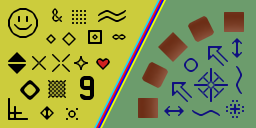
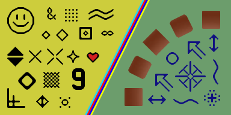

# Go wrapper for [hqx](https://code.google.com/p/hqx/)
## A fast, high-quality magnification filter designed for pixel art.

### Install
```sh
go get github.com/meoow/hqx
```

This library exposes three functions: **Hq2x**, **Hq3x** and **Hq4x**, which magnify by factor of 2, 3 and 4 respectively.

### Example
```go
package main

import "github.com/meoow/hqx"
import "image/png"
import "os"

func main() {
	destfile, _ := os.Create("sample_2x.png")
	defer destfile.Close()

	srcfile, _ := os.Open("sample.png")
	defer srcfile.Close()

	img, _ := png.Decode(srcfile)

	newimg := hqx.Hq2x(img)

	png.Encode(destfile, newimg)
}
```

### Demo
#### 1x

#### 2x

#### 3x

#### 4x

